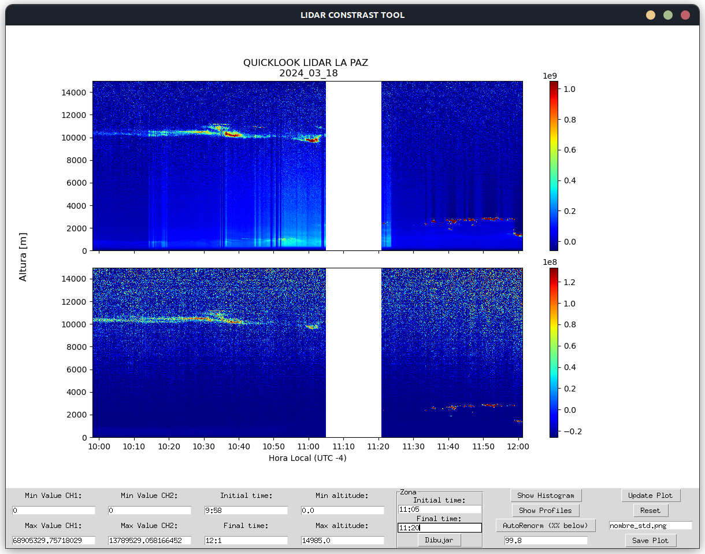

En esta página se encuentra la documentación para el código de LIDAR a utilizar en el instrumento localizado en el campus universitario de Cota Cota.

El código está escrito en Python, y toma de base el código escrito en MATLAB por María Fernanda Sanchez en anteriores gestiones, con adiciones del código escrito por Yoshitaka Jin. La migración y continuo desarrollo del código en Python estuvo a cargo de Ludving Cano[^1] y Kenzo Yoshihara [^2]

# Últimas actualizaciones
## 18/3/2024
Modalidad Barras: En la ventana de Quicklook se encuentra una nueva sección para dibujar una sección blanca, esto genera que se ignoren esos datos y no se necesite realizar muchos cambios de contraste. Se pueden añadir múltiples regiones blancas y éstas se trasladan al gráfico de depolarización.

## 4/3/2024
El código aumentó el módulo de atmósfera estándar y se trabaja en integrarlo al código principal. Bugs surgieron en la búsqueda de carpetas y se encuentra en arreglos. Histogramas dejaron de funcionar.

# Contenidos

----

[^1]: [lcano@chacaltaya.edu.bo](mailto:lcano@chacaltaya.edu.bo).
[^2]: [syoshihara@chacaltaya.edu.bo](mailto:syoshihara@chacaltaya.edu.bo).

