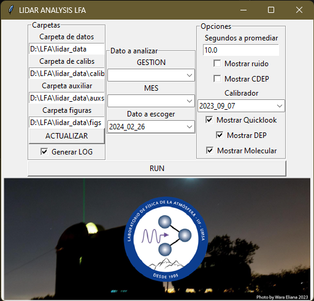

# interactivo.py
_Última actualización: 27 feb 2024_
Como dicho en la página principal, este módulo se centra en crear la interfaz para el menú principal, es llamado como un ejecutable a parte debido a particularidades de la librería usada (`tkinter`). Se apoya de varias funciones en el módulo [read_modules.py](read_modules).

{: .librerias }
> Utiliza las siguientes librerías
> - `tkinter` : Librería de interfaces.
> - `PIL` : (pillow) Para mostrar imágenes.

El menú principal del código se ve como la siguiente figura:

