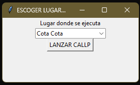

# Archivos de configuración de lugar
Necesitamos dos, el primero genera al otro.

## `pick_place.py`
Este pequeño código genera una ventana con una lista desplegable para escoger el lugar donde se ejecuta el código, una vez seleccionado se genera el archivo `place.py` que tiene como única línea el lugar escogido, este segundo archivo es posteriormente leido por [run_params.py](run_params) para decidir las rutas a utilizar.

{: .librerias }
> Utiliza los siguientes módulos 
> - Tkinter

Crea una ventana como se muestra en la figura  



## `place.py`
Este archivo solamente es un parámetro y se borra con cada actualización, su objetivo es que guarde localmente el lugar donde está instalado el código y así use las rutas establecidas en [`run_params.py`](run_params), se crea automáticamente mediante el módulo de pick place, que es el primero en ejecutarse en caso que no exista el lugar. Si ya existe este archivo el código se salta dicho módulo y entra directamente al menú de escoger dato.

```python
place = "Cota Cota" #para cuando se ejecuta en campus
```
