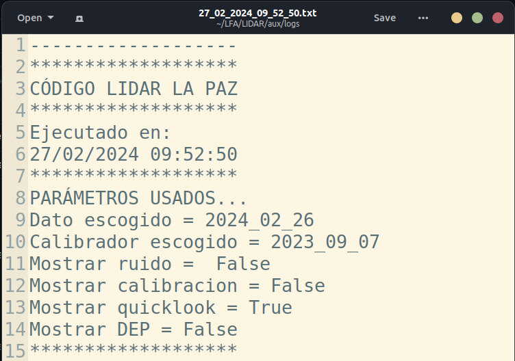

# read_modules.py
{: .no_toc }
Este módulo tiene varias funciones que son llamadas tanto por [lidar_master.py](lidar_master) (directamente) como por el módulo [interactivo.py](interactivo).

1. TOC
{:toc}

{: .librerias }
> Utiliza las siguientes librerías
> - `os` : Manejo de sistema operativo, búsqueda de carpetas y creación de paths.
> - `datetime` : Manejo de fechas y 
> - `numpy` : Librería numérica
> - `tqdm` : Barras de progreso en iteraciones

## 1. Selección de lugar (Función `place_selected()`)
Para definir en qué lugar está siendo ejecutado el código usamos una función llamada `place_selected()`. Esta función busca si existe el archivo llamado `place.py`, en caso cierto define ese como el lugar (para los parámetros predeterminados) y en caso contrario ejecuta la ventana [`pick_place()`](pick_place).

```python
def place_selected():
    if os.path.exists("place.py"):
        pass
    else:
        with open("pick_place.py") as f:
            exec(f.read())
    return
```

## 2. Funciones del archivo log
Las siguientes funciones son utilizadas para escribir en el archivo log, crearlo y crear su header.

### 2.1. `myprint(text, flg)`
Esta función (o mas bien, un proceso) es usada en módulos externos, y nos permite imprimir cualquier cadena de texto directamente en el log actual, para eso necesita el nombre del log una variable global creadad con otra función y una bandera que nos dice si imprimir en log o no (usado para debudding).
```python
def myprint(text, flg):
    if flg:
        log = open(log_fname, "a")
        print(text)
        log.write(text + "\n")
        log.close()
    else:
        print(text)
```

### 2.2. `print_log(txt)`
Esta función es usada solamente en este módulo y sirve simplemente para generar una línea directamente en el log.
```python
def print_log(txt):
    log = open(log_fname, "a")
    log.write(txt + "\n")
    log.close()
```

### 2.3. `create_log(aux_dir, use_log)`
**Retorna `log_fname`**  
Genera el log, usando `aux_dir` (carpeta donde se almacenará) y una bandera (`use_log`) para decidir si crear el archivo o no, usa la fecha y hora actual para generar el archivo con el nombre de la hora actual, retorna el nombre de archivo de log `log_fname`.
```python
def create_log(aux_dir, use_log):
    global log_fname
    if use_log:
        now = datetime.now()
        log_fname = now.strftime("%d_%m_%Y_%H_%M_%S")
        log_fname = log_fname + ".txt"
        log_fname = os.path.join(aux_dir, "logs",log_fname)
        print(log_fname)
    else:
        log_fname = None
    return log_fname
```

### 2.4. `create_header(p, flg)`
Genera el header (inicio) del archivo log, para eso necesita los parámetros iniciales (diccionario `p`) y `flg` nos indica si se usará en el log o solamente en pantalla de terminal.

```python
def create_header(p, flg):

    myprint("-------------------", flg)
    myprint("*******************", flg)
    myprint("CÓDIGO LIDAR LA PAZ", flg)
    myprint("*******************", flg)
    myprint("Ejecutado en:", flg)
    now = datetime.now()
    now = now.strftime("%d/%m/%Y %H:%M:%S")
    myprint(now, flg)
    myprint("*******************", flg)

    if flg:
        print_log("PARÁMETROS USADOS...")
        print_log("Dato escogido = " +p[0])
        print_log("Calibrador escogido = "+ p[1])
        print_log("Mostrar ruido =  "+ str(p[2]))
        print_log("Mostrar calibracion = "+ str(p[3]))
        print_log("Mostrar quicklook = "+ str(p[4]))
        print_log("Mostrar DEP = "+ str(p[5]))
        print_log("*******************")
```

El header del log muestra la siguiente información:


## 3. Buscando datos (`get_data_list(data_rut, p)`)
**Genera el archivo `data.csv`**  
Esta función de forma general busca los datos que cumplan los parámetros deseados dentro de la carpeta `data_rut` (ruta de datos que proviene de [interactivo](interactivo)). Para esto usa la función `os.walk()` que busca tanto en carpetas como en subcarpetas, así los datos se pueden encontrar en cualquier anidación (cada lugar de ejecución tiene diferentes formas de ordenar los datos) y serán encontrados.

```python
def get_data_list(data_rut, p):

    def get_time_date(x):
        # OBTIENE LA FECHA Y HORA A PARTIR DE UN TEXTO
        f = x[:10]
        h = x[13:15]
        m = x[15:17]
        hora = h+":"+m
        return f, hora

    from place import place
    # LOS SEPARADORES SON USADOS DE FORMA DIFERENTE
    # EN WINDOWS Y LINUX
    if place == "Linux":
        separador = "/"
    else:
        separador = "\\"

    df = open("data.csv", "w")
    df.write("fecha,hora,tipo,ruta,carpeta\n")
    c = 0
    for root, dirs, files in os.walk(data_rut):
        # BUSQUEDA DE DATOS EN LA CARPETA data_rut
        if root == p:
            #exluding looking into the calib files
            pass
        elif len(root) > len(p) and root[:len(p)] == p:
            #excluding entering the calib files directory
            pass
        elif len(files) == 2:
            for i in files:
                if i[-12:] == "data_2CH.txt":
                    f, h = get_time_date(i)
                    r = os.path.join(root, i)
                    
                    dr = root.split(separador)
                    ddr = ""
                    for i in dr[:-1]:
                        ddr  = ddr +separador+ i
                    ddr = ddr[1:]
                    linea = f + "," + h + ",data," + r + "," + ddr + "\n"
                    #print(linea)
                    c = c+1
                    df.write(linea)
                if i[-12:] == "dark_2CH.txt":
                    k = "dark"
                    f, h = get_time_date(i)
                    r = os.path.join(root, i)

                    dr = root.split(separador)
                    ddr = ""
                    for i in dr[:-1]:
                        ddr  = ddr +separador+ i
                    ddr = ddr[1:]
                    
                    linea = f + "," + h + ",dark," + r + "," + ddr + "\n"
                    c = c+1
                    df.write(linea)
    print(f"Se escribieron {c} lineas")
    df.close()

```

## 4. Escoger calibrador (`pick_calib(pola_dir, interactivo, picked, use_log)`)

{: .warning} 
Hasta la presente actualización solamente hay un calibrador, es posible que esta función cambie una vez se tomen más calibradores.

Esta función realiza la búsqueda de calibradores válidos en la carpeta de calibradores `pola_dir`, la búsqueda puede ser interactiva **deprecated**, y si se escoge alguno (fecha almacenada en `picked`, almacena y devuelve las rutas.


```python
def pick_calib(pola_dir, interactivo, picked, use_log):
    #*** CAMBIAR SI HAY MAS POLARIZADORES
    # POR AHORA SOLO HAY UNO
    # AQUI AQUIIIIII
    interactivo = False
    ###
    carpetas = os.listdir(pola_dir)
    fechasv = []
    calib_dark = []
    calib_p45 = []
    calib_m45 = []
    for k in carpetas:
        pth = os.path.join(pola_dir, k)
        subpth =  os.listdir(pth)
        fechasv.append(k)
        c = 0
        for i in subpth:
            if 'dark' in i:
                
                xx = os.path.join(pth, i)
                aux = os.listdir(xx)
                for l in aux: 
                    if 'dark' in l: 
                        calib_dark.append(os.path.join(xx, l))
                c = c+1
            if 'p45' in i:
                xx = os.path.join(pth, i)
                aux = os.listdir(xx)
                for l in aux: 
                    if 'p45' in l: 
                        calib_p45.append(os.path.join(xx, l))
                c = c+1
            if 'm45' in i:
                xx = os.path.join(pth, i)
                aux = os.listdir(xx)
                for l in aux: 
                    if 'm45' in l: 
                        calib_m45.append(os.path.join(xx, l))
                c = c+1
        if c != 3:
            myprint(f"{k}: Carpeta incompleta", use_log)

    df = pd.DataFrame(list(zip(fechasv, calib_dark, calib_p45, calib_m45)), columns = ["fecha", "dark", "p45", "m45"])

    #ESCOGIDO
    #auto
    if interactivo:
        print("Datos disponibles de depolarización")
        for i, j in enumerate(df.fecha):
            print(i, " >> ",j)
        print("Escoja un índice")
        idx = int(input(">>> "))
        d = df.iloc[idx]
        ff = d.fecha
        ruta_p45 = d.p45
        ruta_m45 = d.m45
        calib_dark = d.dark
    else:
        d = df[df.fecha == picked]
        if len(d) == 0:
            myprint("ERROR: FECHA ESCOGIDA DE CALIBRADOR NO VALIDA", use_log)
            myprint("Revisar parámetro 'calib_picked' o correr en interactivo", use_log)
            exit
        else:
            ruta_p45 = d.p45.to_list()[0]
            ruta_m45 = d.m45.to_list()[0]
            calib_dark = d.dark.to_list()[0]
            ff = d.fecha.to_list()[0]
    myprint(f"Calibrador de {ff} establecido", use_log)
    myprint("Correcto!", use_log)

    return ruta_p45, ruta_m45, calib_dark

```

## 4. Ruta de datos (`pick_data(use_log, interactivo, ya_escogido)`)

{: .parametros }
> Tiene los siguientes inputs:
> - `use_log` : Imprimir información también en el log.
> - `interactivo` : (sin uso) Falso desde el uso de interfaz 
> - `ya_escogido` : Fecha de datos a analizar
>   
> Devuelve:
> - `escogido` : Ruta de los datos a leer.
> - `ruta_dark` : Ruta de los darks a usar en calibración 
> - `f` : Fecha de datos a analizar
> - `carpeta_gen`: Carpeta de los datos, ahí almacenaremos algunos archivos temporales.


Una vez escogido un dato (fecha en `ya_escogido`), establecemos la ruta usando la tabla `data.csv`, establecemos las rutas y devolvemos los siguientes parámetros.
```python
def pick_data(use_log, interactivo, ya_escogido):
    myprint("Archivo leído ", use_log)
    df = pd.read_csv("data.csv")
    d = pd.read_csv("data.csv")
    df = df[df.tipo == "data"]
    df.reset_index(inplace = True)

    escogido = df[df.fecha == ya_escogido]
    aux = d[(d.fecha == ya_escogido) & (d.tipo == "dark")]
    carpeta_gen = escogido.carpeta.to_list()[0]
    escogido = escogido.ruta.to_list()[0]
    myprint(f"Se escogieron los datos del {ya_escogido}", use_log)
    f = ya_escogido
    
    if len(aux) > 0:
        myprint("Se encontró el archivo dark correspondiente", use_log)
    else:
        myprint("NO SE ENCONTRÓ ARCHIVO DARK ESE DÍA, REVISAR CARPETAS", use_log)
        exit
    
    myprint("Ruta establecida", use_log)
    ruta_dark = aux.ruta.to_list()[0]
    return escogido, ruta_dark, f, carpeta_gen
    
```

## 5. Lectura de datos (`read_sig(ifile)`)
Lee los datos dados en una ruta.

{: .parametros }
> Tiene los siguientes inputs:
> - `ifile` : Ruta de los datos a leer
> 
> Devuelve:
> - `t0` : Vector de tiempos (en horas decimales).
> - `ch1` : Matriz de datos canal 1 
> - `ch2` : Matriz de datos canal 2

```python
def read_sig(ifile):
    rnz = 1000  #Largo de los datos (original)
    anz = 500   #Largo post-promediado
    nz = rnz
    # open file
    #='2023_08_09_HR1033_A90_data_2CH.txt'
    with open(file=ifile,mode='r') as fin:
        lines = fin.readlines()
        n = int(len(lines) / 2) # number of lines
        t0  = np.empty(n)
        ch1 = np.empty([nz,n])
        ch2 = np.empty([nz,n])
        for i in tqdm(range(n), "Leyendo datos..."):
            ii = i * 2
            line1 = lines[ii].strip().split()
            line2 = lines[ii+1].strip().split()
            t0[i] = float(line1[0])+float(line1[1])/60.0+float(line1[2])/3600.0
            ch1[:,i] = np.array([float(line1[4+j])*1e3 for j in range(nz)])
            ch2[:,i] = np.array([float(line2[1+j])*1e3 for j in range(nz)])
    
    print("Original data shape : ", ch1.shape)
    return t0,ch1,ch2
```
