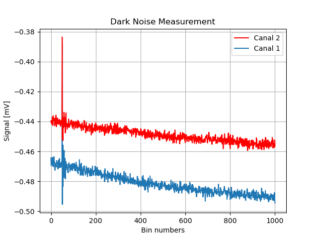

# Corriente oscura

El cálculo de corriente oscura consiste en obtener una señal cuando el telescopio no recibe señal externa, es decir, está tapado, así podemos descartar esta señal que se debe principalmente a la electrónica propia del instrumento. Para eso necesitamos archivos complementarios llamados **dark**. Este procedimiento se realiza antes de cada disparo de LIDAR, y los perfiles son promediados en tiempo, así obteniendo un único vector de dimensiones $[1000,1]$, este vector será sustraido de los datos en posteriores procesos.

{: .librerias }
> Utiliza las siguientes librerías
> - `numpy` : Librería numérica
> - `matplotlib` : Librería para gráficos
> - `read_sig` y `myprint`: Módulos de apoyo que se encuentran en [read_modules.py](../preanalisis/read_modules)

## Cálculo de corriente oscura [`dark_noise(ruta_dark, interactivo, plot_dark, use_log)`]

{: .parametros }
> Tiene los siguientes inputs:
> - `ruta_dark` : Ruta de los dark, obtenidos de [read_modules.py](../preanalisis/read_modules)
> - `interactivo` : (sin uso) Falso desde el uso de interfaz 
> - `plot_dark` : Mostrar gráfico de ruido? Se obtiene de la interfaz [interactivo.py](../preanalisis/interactivo)
> - `use_log` : Imprimir información en el log?
>   
> Devuelve:
> - `ych1` : Ruido canal 1 (vector).
> - `ych2` : Ruido canal 2 (vector).

```python
def dark_noise(ruta_dark, interactivo, plot_dark, use_log):
    #TODO ES CORRIENTE OSCURA
    myprint("CÁLCULO DE CORRIENTE OSCURA...", use_log)
    t0a,ch1a,ch2a=read_sig(ruta_dark) #Se leen las señales de calibradores
    x = np.linspace(0, 1000, 1000)  # Crea un array desde 0 hasta 1000 con 1000 puntos
    # Datos para el eje y
    #y = matrixch1[0, :]  # Toma todos los datos de la primera fila de la matriz

    ## RUIDOS, PROMEDIADO DE LOS DATOS
    average_vectorch1 = np.mean(ch1a, axis=1)
    ych1= average_vectorch1#*1000.
    average_vectorch2 = np.mean(ch2a, axis=1)
    ych2= average_vectorch2#*1000.

    #print(average_vector)
    # Crear el gráfico si plot_dark = True
    if plot_dark:
        plt.ylim(-0.45, -0.05)
        plt.grid(True)
        linech1,=plt.plot(x, ych1)
        linech2,=plt.plot(x, ych2, color='red', label='Canal 2')
        # Etiquetas y título
        # Añade la primera leyenda como un artista más para que no se elimine
        linech1.set_label('Canal 1')
        linech2.set_label('Canal 2')
        # Segunda leyenda
        plt.legend(handles=[linech2, linech1], loc='upper right')
        plt.xlabel('Bin numbers')
        plt.ylabel('Signal [mV]')

        plt.title('2023/09/07 Dark Noise Measurement')
        plt.show()
    myprint("Correcto!", use_log)
    return ych1, ych2
```

## Gráfico
El gráfico resultante es semejante a lo siguiente:



